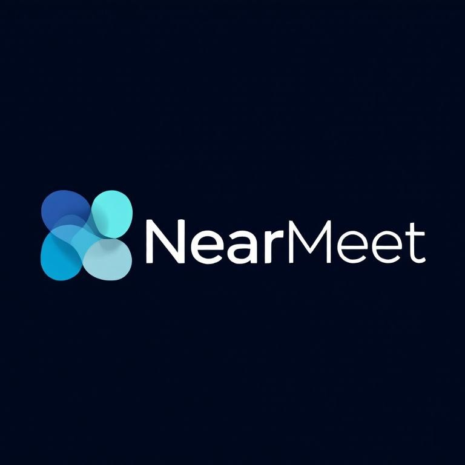

# NearMeet - Application de Communication Locale



**NearMeet** est une application de communication locale multi-fonctions conçue pour permettre aux utilisateurs de discuter, partager des fichiers, passer des appels vidéo/audio, et collaborer en temps réel sur un même réseau local (LAN).

## 📋 Table des matières

- [Caractéristiques](#-caractéristiques)
- [Installation](#-installation)
- [Utilisation](#-utilisation)
- [Architecture](#-architecture)
- [Technologies](#-technologies)
- [Documentation](#-documentation)
- [Contribution](#-contribution)
- [Licence](#-licence)

## ✨ Caractéristiques

### Fonctionnalités principales

- 💬 **Chat texte en temps réel** - Messagerie instantanée avec historique
- 📁 **Partage de fichiers** - Envoi de fichiers via le réseau local
- 📹 **Appels vidéo** - Communication vidéo 1:1 ou en groupe
- 🔊 **Appels audio** - Appels voix et messages audio
- 🖥️ **Partage d'écran** - Diffusion de l'écran aux autres participants
- 🔐 **Chiffrement** - Messages sécurisés avec AES/RSA
- 👥 **Gestion des utilisateurs** - Pseudonymes, statuts et présence
- 🔍 **Recherche** - Filtrez les messages par mot-clé ou utilisateur
- 📊 **Base de données** - Historique persistant avec SQLite

### Priorités des fonctionnalités

| Fonctionnalité | Priorité |
|---|---|
| Chat texte | 🔴 Haute |
| Partage de fichiers | 🔴 Haute |
| Appels vidéo | 🔴 Haute |
| Historique des messages | 🔴 Haute |
| Appels audio | 🟡 Moyenne |
| Partage d'écran | 🟡 Moyenne |
| Messages audio | 🟡 Moyenne |
| Chiffrement | 🟡 Moyenne |
| Salons de discussion | 🟢 Basse |
| Meet (groupe) | 🟢 Basse |
| Statut utilisateur | 🟢 Basse |

## 🚀 Installation

### Prérequis

- **Python 3.11+**
- **pip** ou **conda**
- Un réseau local (LAN)
- Accès au microphone et à la caméra (optionnel)

### Étapes d'installation

1. **Clonez le dépôt**

```bash
git clone https://github.com/yourusername/NearMeet.git
cd NearMeet
```

2. **Créez un environnement virtuel**

```bash
python -m venv venv
```

Sur Windows :
```bash
venv\Scripts\activate
```

Sur macOS/Linux :
```bash
source venv/bin/activate
```

3. **Installez les dépendances**

```bash
pip install -r requirements.txt
```

4. **Configurez l'application**

```bash
cp .env.example .env
# Éditez .env avec vos paramètres
```

5. **Lancez l'application**

```bash
python -m nearmeet
```

## 📖 Utilisation

### Lancer le serveur

```bash
python -m nearmeet --server --port 5000
```

### Se connecter comme client

```bash
python -m nearmeet --client --host 192.168.1.100 --port 5000 --username "MonPseudo"
```

### Options de configuration

- `--server` : Lancer en mode serveur
- `--client` : Lancer en mode client
- `--port` : Port d'écoute/connexion (défaut: 5000)
- `--host` : Adresse IP du serveur (client uniquement)
- `--username` : Pseudonyme de l'utilisateur
- `--config` : Fichier de configuration personnalisé

## 🏗️ Architecture

### Structure du projet

```
NearMeet/
├── README.md                    # Ce fichier
├── requirements.txt             # Dépendances Python
├── setup.py                     # Configuration de build
├── .gitignore                   # Fichiers ignorés par Git
├── .env.example                 # Exemple de configuration
│
├── src/
│   ├── __main__.py              # Point d'entrée principal
│   ├── config.py                # Configuration globale
│   ├── constants.py             # Constantes de l'application
│   │
│   ├── core/                    # Cœur de l'application
│   │   ├── __init__.py
│   │   ├── app.py               # Application principale
│   │   └── enums.py             # Énumérations
│   │
│   ├── network/                 # Gestion réseau
│   │   ├── __init__.py
│   │   ├── server.py            # Serveur TCP/UDP
│   │   ├── client.py            # Client TCP/UDP
│   │   ├── protocol.py          # Protocoles de communication
│   │   ├── handlers.py          # Gestionnaires de messages
│   │   └── security.py          # Chiffrement et sécurité
│   │
│   ├── ui/                      # Interface utilisateur (PyQt6)
│   │   ├── __init__.py
│   │   ├── main_window.py       # Fenêtre principale
│   │   ├── dialogs.py           # Boîtes de dialogue
│   │   ├── widgets.py           # Widgets personnalisés
│   │   ├── video_window.py      # Fenêtre d'appel vidéo
│   │   ├── styles.py            # Styles CSS/QSS
│   │   └── resources.py         # Ressources (icônes, etc.)
│   │
│   ├── chat/                    # Gestion du chat
│   │   ├── __init__.py
│   │   ├── message.py           # Classe Message
│   │   ├── manager.py           # Gestionnaire de chat
│   │   └── formatter.py         # Formatage des messages
│   │
│   ├── media/                   # Médias (audio/vidéo)
│   │   ├── __init__.py
│   │   ├── audio.py             # Gestion audio
│   │   ├── video.py             # Gestion vidéo
│   │   └── screen.py            # Partage d'écran
│   │
│   ├── database/                # Base de données
│   │   ├── __init__.py
│   │   ├── db.py                # Gestion SQLite
│   │   ├── models.py            # Modèles de données
│   │   └── queries.py           # Requêtes SQL
│   │
│   ├── file_sharing/            # Partage de fichiers
│   │   ├── __init__.py
│   │   ├── manager.py           # Gestionnaire de fichiers
│   │   └── transfer.py          # Protocole de transfert
│   │
│   └── utils/                   # Utilitaires
│       ├── __init__.py
│       ├── logger.py            # Logging
│       ├── helpers.py           # Fonctions auxiliaires
│       └── validators.py        # Validation des données
│
├── tests/                       # Tests unitaires et intégration
│   ├── __init__.py
│   ├── test_network.py
│   ├── test_chat.py
│   ├── test_database.py
│   └── test_file_sharing.py
│
├── docs/                        # Documentation
│   ├── Cahier_des_Charges.md    # Spécifications du projet
│   ├── INSTALL.md               # Guide d'installation détaillé
│   ├── USER_GUIDE.md            # Manuel utilisateur
│   ├── API.md                   # Documentation API
│   ├── ARCHITECTURE.md          # Architecture détaillée
│   └── CONTRIBUTING.md          # Guide de contribution
│
├── config/                      # Fichiers de configuration
│   └── default.json             # Configuration par défaut
│
├── assets/                      # Ressources (images, icônes)
│   ├── logo.png
│   ├── icons/
│   └── screenshots/
│
└── scripts/                     # Scripts utilitaires
    ├── build.sh                 # Build l'application
    ├── test.sh                  # Lance les tests
    └── deploy.sh                # Déploie l'application
```

### Flux de communication

```
Client 1                    Serveur                    Client 2
   |                           |                           |
   |--------TCP Connect-------->|                           |
   |                           |<-------TCP Connect--------|
   |                           |                           |
   |---Message (JSON)--------->|--------Message (JSON)---->|
   |                           |                           |
   |<---------Ack-----------|<---------Ack---------|
   |                           |                           |
   |-------UDP Stream(Video)-->|-------UDP Stream(Video)-->|
```

## 🛠️ Technologies

### Frameworks et bibliothèques

| Catégorie | Technologie | Utilisation |
|---|---|---|
| **Interface** | PyQt6 | UI et widgets |
| **Réseau** | Sockets TCP/IP, UDP | Communication |
| **Vidéo** | OpenCV, PyQt6.QtMultimedia | Capture et streaming vidéo |
| **Audio** | pyaudio, sounddevice | Capture et streaming audio |
| **Partage d'écran** | mss, Pillow | Capture d'écran |
| **Base de données** | SQLite3 | Historique persistant |
| **Chiffrement** | cryptography | Sécurité |
| **Notifications** | plyer | Alertes système |
| **Logging** | logging | Journalisation |

### Versions requises

- Python 3.11+
- PyQt6 6.5+
- OpenCV 4.8+
- sqlite3 (inclus dans Python)

## 📚 Documentation

Consultez les fichiers de documentation pour plus d'informations :

- **[INSTALL.md](docs/INSTALL.md)** - Guide d'installation détaillé
- **[API.md](docs/API.md)** - Documentation des APIs
- **[ARCHITECTURE.md](docs/ARCHITECTURE.md)** - Architecture technique détaillée
- **[Cahier_des_Charges.md](docs/Cahier_des_Charges.md)** - Spécifications fonctionnelles
- **[CONTRIBUTING.md](docs/CONTRIBUTING.md)** - Guide de contribution

## 🤝 Contribution

Les contributions sont les bienvenues ! Consultez [CONTRIBUTING.md](docs/CONTRIBUTING.md) pour les directives.

### Étapes de contribution

1. Forkez le dépôt
2. Créez une branche (`git checkout -b feature/AmazingFeature`)
3. Commitez vos changements (`git commit -m 'Add AmazingFeature'`)
4. Poussez vers la branche (`git push origin feature/AmazingFeature`)
5. Ouvrez une Pull Request

## 📝 Licence

Ce projet est sous licence MIT. Consultez le fichier [LICENSE](LICENSE) pour plus de détails.

## 🐛 Signaler un bug

Avez-vous trouvé un bug ? Veuillez créer une [issue](https://github.com/yourusername/NearMeet/issues) avec une description détaillée.

## 💬 Support

Pour toute question ou support, veuillez :

- Créer une [issue](https://github.com/yourusername/NearMeet/issues)
- Consulter la [documentation](docs/)
- Nous contacter via email

---

**Dernière mise à jour :** 15 janvier 2026

Made with ❤️ by IndraLabs
